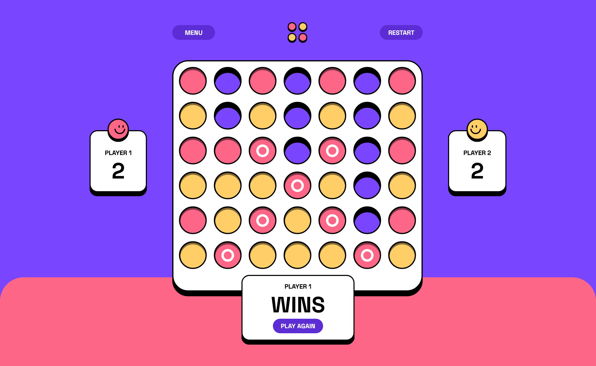

# Frontend Mentor - Connect Four game solution

This is a solution to the [Connect Four game challenge on Frontend Mentor](https://www.frontendmentor.io/challenges/connect-four-game-6G8QVH923s). Frontend Mentor challenges help you improve your coding skills by building realistic projects.

## Table of contents

- [Overview](#overview)
  - [The challenge](#the-challenge)
  - [Screenshot](#screenshot)
  - [Links](#links)
- [My process](#my-process)
  - [Built with](#built-with)
  <!-- - [What I learned](#what-i-learned) -->
  - [Continued development](#continued-development)
  <!-- - [Useful resources](#useful-resources) -->
- [Author](#author)
<!-- - [Acknowledgments](#acknowledgments) -->

## Overview

### The challenge

Users should be able to:

- View the game rules
- Play a game of Connect Four against another human player (alternating turns on the same computer)
- View the optimal layout for the interface depending on their device's screen size
- See hover and focus states for all interactive elements on the page
- See the discs animate into their position when a move is made
- Play against the computer

### Screenshot

### Links

- Solution URL: [FEM](https://www.frontendmentor.io/solutions/connect-four-game-JTx24XdDIp)
- Live Site URL: [Netlify](https://poetic-kashata-bd9f2e.netlify.app/)

## My process

### Built with

- Vite
- React
- Tailwindcss

<!-- ### What I learned -->

### Continued development

I'd like to improve the animations, add sounds and maybe add a backend so two people can play live.

## Author

- Website - [Mehdi Zibout](https://www.zryqv.com)
- Frontend Mentor - [@mehdi-zibout](https://www.frontendmentor.io/profile/mehdi-zibout)
